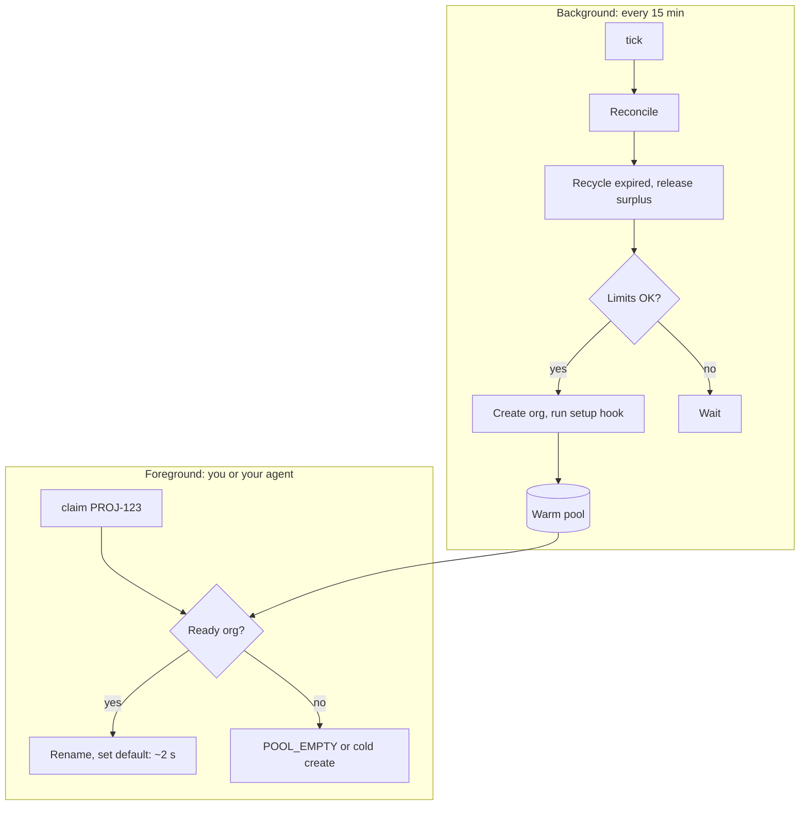

# scratchpool

**Claim a Salesforce scratch org that is already created, deployed and aliased, in about two seconds.** A small pool lives on your own machine and refills itself in the background with your own Dev Hub.

[](LICENSE)
[](https://github.com/Tbristo01/scratchpool/actions/workflows/ci.yml)
[](https://nodejs.org/)


On a phone? [Open the demo full size](docs/demo/scratchpool-demo.svg).

**Measured so far:** warm `claim` 1.9 to 2.9 s, against 15.5 s for a cold create plus deploy on a 5-class smoke project. That smoke project is the best case for cold creates, so this proves the mechanism, not the savings. A benchmark on real repos (package installs, data loads, features) is pending. See [docs/benchmarks.md](docs/benchmarks.md).

## Why

- **Sandboxes are long-lived; scratch orgs are short-lived.** You want a fresh scratch org for every ticket, repro or PR check, but each one costs a create plus your setup (deploy, packages, data) before you can work.
- **The pool lives on your laptop.** Your OS scheduler (launchd, systemd `--user` or Task Scheduler) runs `scratchpool tick` every 15 minutes to recycle and refill. `claim` is just an alias rename.
- **Your own Dev Hub.** Every org is created with your own `sf` auth, so you own it. No shared credentials.
- **No server.** No hosted service, database or telemetry. The only remote endpoint is Salesforce, through your own `sf` CLI. Zero npm dependencies.

[sf-skills](https://github.com/forcedotcom/sf-skills) `dx-org-manage` creates orgs and does it well. scratchpool does not replace it: **sf-skills creates orgs; scratchpool hands you one that's already set up.**

## Install

Pick one. Every path runs the same zero-dependency Node script. Only the global npm install below puts a `scratchpool` command on your PATH; the agent paths run the script from the installed skill folder.

**Claude Code (plugin).** In a Claude Code session:

```text
/plugin marketplace add Tbristo01/scratchpool
/plugin install scratchpool@scratchpool
```

Or from a shell: `claude plugin marketplace add Tbristo01/scratchpool && claude plugin install scratchpool@scratchpool`.

**Codex, Cursor, Copilot, Gemini CLI and other agents** ([Agent Skills](https://github.com/vercel-labs/skills) CLI):

```sh
npx skills add Tbristo01/scratchpool
```

Run inside an agent, this installs into `.agents/skills/` without prompting and links it for the agent it detects. In a normal terminal it asks for the scope and agents; pass `-y --agent <name>` to skip the prompts, or `-g` for a user-level install. It also writes a `skills-lock.json` in the project and sends the skills CLI's own install telemetry event (scratchpool itself sends none).

**Plain CLI** (not on the npm registry; installs straight from GitHub):

```sh
npm install -g github:Tbristo01/scratchpool          # puts `scratchpool` on your PATH
npx -y github:Tbristo01/scratchpool --help           # or run it without installing
npx -y github:Tbristo01/scratchpool#v0.1.0 --help    # pinned to a release
```

Or clone it, and use `node scratchpool/skills/scratchpool/scripts/scratchpool.mjs` wherever this README says `scratchpool`:

```sh
git clone https://github.com/Tbristo01/scratchpool
node scratchpool/skills/scratchpool/scripts/scratchpool.mjs --help
```

In a terminal, `--help` and `--version` print plain text. When stdout is not a terminal (a pipe, CI or an agent), every command, these two included, prints one JSON object instead; see [Commands](#commands).

**claude.ai.** Download `scratchpool-skill-<version>.zip` from the [latest release](https://github.com/Tbristo01/scratchpool/releases/latest) (check it against `SHA256SUMS`) and upload it as a custom skill under Settings > Capabilities.

### Prerequisites

- [Salesforce CLI](https://developer.salesforce.com/tools/salesforcecli) (`sf`) 2.147.7 or later (needed for the scratch org signup variables in [docs/ci-auth.md](docs/ci-auth.md); older versions still run, with an `SF_OLD` warning)
- Node.js 20 or later
- A Dev Hub you have authorised in `sf` (`sf org login web --set-default-dev-hub --alias my-devhub`). To get one, [enable Dev Hub](https://developer.salesforce.com/docs/platform/sfdx-dev/guide/sfdx-setup-enable-devhub.html) in Setup on a production or Developer Edition org; once enabled it cannot be turned off. A Developer Edition Dev Hub allows 3 active and 6 daily scratch orgs (see [Limits and sizing](#limits-and-sizing))
- A project with `sfdx-project.json` and a scratch org definition (default `config/project-scratch-def.json`) or a [snapshot](docs/snapshots.md)

## 60-second quick start

**From Claude Code** (or any agent with the skill), in your project:

> Set up a scratch org pool for this project with my-devhub, size 2
>
> How is my scratch org pool doing?
>
> Give me a scratch org for PROJ-123
>
> I'm done with PROJ-123, release it

**From a terminal** (if you did not `npm install -g`, use `npx -y github:Tbristo01/scratchpool` or `node <clone>/skills/scratchpool/scripts/scratchpool.mjs` in place of `scratchpool`):

```sh
scratchpool init --hub my-devhub --size 2   # configure, install the scheduler, start filling
scratchpool status                          # ready / creating / claimed, limits, service
scratchpool claim PROJ-123                  # a warm org becomes PROJ-123 and your default org
scratchpool release PROJ-123                # delete it and free the Dev Hub slot
```

The first orgs take a normal create (plus your setup hook) to warm up. After that, each claim takes a warm org and triggers one background refill. To make "warm" mean "ready", add a setup hook: an executable `.scratchpool/setup` (or `setup.mjs` / `setup.cmd`) in your project that deploys source, installs packages or loads data, then run `init --setup-hook`. See [examples/setup.example.sh](examples/setup.example.sh).

## Commands

| Command | What it does |
|---|---|
| `init` | Configure the pool for this project, install the background service, run a first tick. Safe to re-run |
| `claim [alias]` | Take a warm org, rename it to `alias` and make it this project's default org. Empty pool: `POOL_EMPTY` (agents) or a cold create (interactive, or `--cold --yes` from scripts and agents) |
| `release <alias…>` | Delete orgs you own and free their slots. Alias: `return` |
| `status` | Pool entries, life left, Dev Hub limits, service state. Alias: `list` |
| `config` | `show`, `get <key>` or `set <key> <value>`: read or change pool settings |
| `pause` / `resume` | Stop or restart refilling. Claims still work while paused |
| `tick` | What the scheduler runs. Run it yourself to fill now |
| `service` | `install`, `uninstall` or `status` of the per-user scheduler entry |
| `uninstall` | Remove the service and optionally the pool orgs. Claimed orgs are kept |

Flags:

```text
init       [--hub <alias>] [--size <n>] [--def <path> | --snapshot <name>]
           [--duration <days>] [--interval <minutes>] [--setup-hook] [--no-service]
claim      [alias] [--cold [--yes]] [--any] [--no-open]
release    <alias...> | --pool-orgs | --surplus | --stale | --orphans  [--yes]
uninstall  [--release-pool-orgs] [--yes]
```

`init` writes only to `<SCRATCHPOOL_HOME>` (config, state, logs) and the per-user scheduler entry (a LaunchAgent, a systemd `--user` timer or a scheduled task); it never writes into your project. `claim` sets the default org with `sf config set target-org`, which `sf` stores in the project's `.sf/` folder.

Every command accepts `--pool <name>` and `--json`. With `--json` (or when stdout is not a TTY) each command prints exactly one `scratchpool/v1` object with documented exit codes; see [docs/SPEC.md](docs/SPEC.md).

## Configuration

One user-level file, `<SCRATCHPOOL_HOME>/config.json` (default `~/.config/scratchpool`, `%APPDATA%\scratchpool` on Windows). Change it from the CLI:

```sh
scratchpool config set size 3               # keep 3 warm
scratchpool config set size 0               # keep nothing warm
scratchpool config set intervalMinutes 30   # global; reinstalls the service
```

Other keys: `hub`, `definitionFile`, `snapshot`, `durationDays`, `coldDurationDays`, `setupHook`, `dailyFloor`, `teamCapPct`, `claimMinLifeHours`, `activeReserve`. `config set` never creates or deletes orgs; the next tick does.

## How it works



A tick reconciles its state with `sf org list`, and each claim starts one refill tick in the background. Each tick takes a per-pool lock and writes state atomically. Allocation limits are checked only before creating, never on the claim path. Scheduler details, file locations and troubleshooting: [docs/background-service.md](docs/background-service.md). For CI, see [docs/ci-auth.md](docs/ci-auth.md).

## Safety

- Output fields are copied from an allowlist: tokens, auth URLs, frontdoor URLs and passwords never reach output, logs or an agent's context, and every message is scrubbed.
- `sf` is spawned with argument arrays only (on Windows, through `cmd.exe` with escaped arguments).
- `release` only deletes orgs in your own pool state that your own Dev Hub created; `claim` never repoints an alias of a Dev Hub, sandbox or production org.
- scratchpool refuses to run when `SF_TEMP_SHOW_SECRETS` is set.

For agents, also merge [examples/settings.deny.json](examples/settings.deny.json) into your Claude Code settings: it blocks the `sf` commands that would print credentials. Full threat model: [docs/security.md](docs/security.md). Reporting a vulnerability: [SECURITY.md](SECURITY.md).

## Limits and sizing

Each pool org holds one active scratch org slot, and each refill uses one daily create, exactly like orgs you create by hand. A Developer Edition Dev Hub allows 3 active and 6 daily, so keep `size` at 1 there. scratchpool keeps an active reserve and a daily floor, and caps its tagged orgs at a share of the hub (`teamCapPct`, default 25%) so one developer's pool can't starve a shared hub. How to pick a size and duration: [docs/pool-sizing.md](docs/pool-sizing.md).

## Uninstall

Remove the scheduler entry before you remove the code, or it keeps running `tick`:

```sh
scratchpool uninstall                      # remove the scheduler entry; pool orgs stay until they expire
scratchpool uninstall --release-pool-orgs  # also delete the unclaimed pool orgs (claimed orgs are kept)
```

Then remove whichever install you used:

```sh
claude plugin uninstall scratchpool@scratchpool && claude plugin marketplace remove scratchpool
npx skills remove scratchpool              # add -g if you installed with -g
npm uninstall -g scratchpool
```

Config, state and logs stay in `<SCRATCHPOOL_HOME>` (`~/.config/scratchpool`, or `%APPDATA%\scratchpool` on Windows); delete that folder to remove them. Details: [docs/background-service.md](docs/background-service.md#uninstalling).

## FAQ

**Does it work with sandboxes?** No. scratchpool only manages scratch orgs, and never repoints an alias that names a sandbox, production org or Dev Hub.

**Can my team share one pool?** Not in v0.1, by design. Each developer runs their own pool with their own Dev Hub auth, so there are no shared credentials or hosted service. The team cap keeps several personal pools on one hub fair.

**Does it work on Windows?** Yes, through Task Scheduler. CI runs on Windows, but it has had less real-world use than macOS and Linux.

**What does it cost?** Nothing but your own Dev Hub allocations. There is no service to pay for.

**What if the pool is empty?** In a terminal, `claim` falls back to a cold create. Agents get a retryable `POOL_EMPTY` so they can decide.

## Roadmap and kill criteria

- **v0.1 (now):** local pool, background refill, setup hook, snapshots, guards, four install paths.
- **v0.2:** faster warm path (target under 2 s), stale and orphan hygiene, team-cap view, snapshot refresh, Windows fixes.
- **v1.0:** sfp migration guide, multi-model evals, upstream proposal to `forcedotcom/sf-skills`.

The project stops, and the work goes upstream to sf-skills, if a warm claim does not beat cold create plus setup by at least 3 minutes on 2 real repos, if fewer than 3 developers besides the author use `claim` weekly for 4 weeks by day 60, or if Salesforce ships native scratch org pooling.

## Contributing

Issues and pull requests are welcome. Read [CONTRIBUTING.md](CONTRIBUTING.md) and the [Code of Conduct](CODE_OF_CONDUCT.md); [docs/SPEC.md](docs/SPEC.md) is the contract. Tests use a stub `sf` and never touch a real Dev Hub: `npm test`. More docs: [docs/README.md](docs/README.md).

## Credits

<!-- credits:start -->
scratchpool stands on prior work: the scratch org pool idea from [sfp](https://github.com/flxbl-io/sfp), [sfdx-hardis](https://github.com/hardisgroupcom/sfdx-hardis) and [sf-cli-plugin-pool](https://github.com/navikt/sf-cli-plugin-pool), Salesforce's own [sf-skills](https://github.com/forcedotcom/sf-skills) and [DX MCP server](https://github.com/salesforcecli/mcp), and what the [sfdx-core](https://github.com/forcedotcom/sfdx-core) source and the [sf CLI issue tracker](https://github.com/forcedotcom/cli/issues) taught us. It contains no third-party code. What we took from each is in [CREDITS.md](CREDITS.md); the attribution notice is in [NOTICE](NOTICE). Why it is built this way: [docs/design-rationale.md](docs/design-rationale.md).

Salesforce, Dev Hub and related marks are trademarks of Salesforce, Inc.; Claude is a trademark of Anthropic, PBC. scratchpool is an independent project, not affiliated with or endorsed by either.
<!-- credits:end -->

## License

[Apache-2.0](LICENSE). Copyright 2026 Tishaun Bristol ([@Tbristo01](https://github.com/Tbristo01)).
