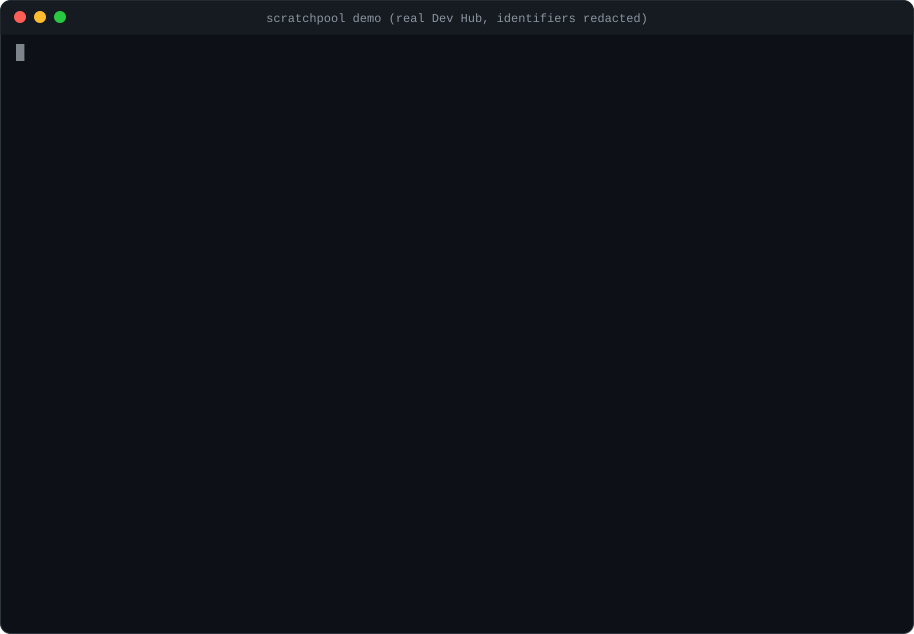
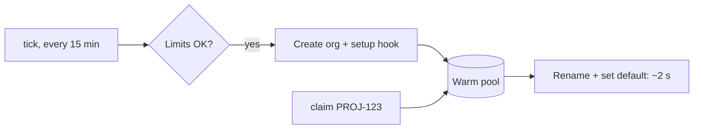

# scratchpool

**Claim a Salesforce scratch org that's already created, deployed and aliased, in about two seconds.** A small pool lives on your machine and refills itself in the background with your own Dev Hub. It has no server and no npm dependencies.

[](LICENSE)
[](https://github.com/Tbristo01/scratchpool/actions/workflows/ci.yml)
[](https://nodejs.org/)
[](https://scorecard.dev/viewer/?uri=github.com/Tbristo01/scratchpool)



[Open the demo full size](docs/demo/scratchpool-demo.svg) · **So far:** a warm `claim` takes 1.9–2.9 s. A cold create plus deploy takes 15.5 s on a 5-class smoke project. A real-repo benchmark is pending ([benchmarks](docs/benchmarks.md)).

## Why

- **Scratch orgs are short-lived, but setting one up isn't quick.** Every ticket, repro or PR check pays for a create plus deploy, packages and data before you can work.
- **The pool does that work ahead of time, on your laptop.** Your OS scheduler (launchd, systemd `--user` or Task Scheduler) runs `scratchpool tick` every 15 minutes. `claim` is just an alias rename.
- **You own every org.** Orgs are created with your own `sf` auth. There are no shared credentials, hosted service or telemetry.

Salesforce's [sf-skills](https://github.com/forcedotcom/sf-skills) `dx-org-manage` *creates* orgs. scratchpool *hands you one that's already set up*.

## Install

You need `sf` 2.147.7 or later, Node 20 or later, and an authorised Dev Hub. Other paths (Codex, Cursor, Copilot, claude.ai) and uninstall steps are in [docs/install.md](docs/install.md).

```text
# Claude Code
/plugin marketplace add Tbristo01/scratchpool
/plugin install scratchpool@scratchpool
```

```sh
# Any agent with Agent Skills
npx skills add Tbristo01/scratchpool

# Plain CLI
npm install -g github:Tbristo01/scratchpool
```

## Quick start

In Claude Code, ask: *"Set up a scratch org pool for this project with my-devhub, size 2"*, then *"Give me a scratch org for PROJ-123"*. From a terminal:

```sh
scratchpool init --hub my-devhub --size 2   # configure, install the scheduler, start filling
scratchpool claim PROJ-123                  # a warm org becomes PROJ-123 and your default org
scratchpool release PROJ-123                # delete it and free the Dev Hub slot
```

To make "warm" mean "ready", add an executable `.scratchpool/setup` that deploys source, installs packages or loads data, then run `init --setup-hook`. See [the example](examples/setup.example.sh).

## Commands

| Command | What it does |
|---|---|
| `init` | Configures the pool, installs the scheduler and fills the pool. Safe to re-run. |
| `claim [alias]` | Takes a warm org, renames it to `alias` and sets it as the default. If the pool is empty, you get `POOL_EMPTY` (agents) or a cold create (terminal). |
| `release <alias…>` | Deletes orgs you own and frees their slots. `--stale`, `--surplus` and `--pool-orgs` clean up in bulk. |
| `status` | Shows pool entries, life left, Dev Hub limits and the scheduler. |
| `config set <key> <value>` | Changes settings, for example `size 3` or `intervalMinutes 30`. |
| `pause` / `resume` | Stops or restarts refilling. Claims still work while paused. |
| `tick` | Fills the pool now (this is what the scheduler runs). |
| `uninstall` | Removes the scheduler. Claimed orgs are kept. |

Every command takes `--json` and prints one `scratchpool/v1` object with documented exit codes. Full flags and the contract are in [docs/SPEC.md](docs/SPEC.md).

## How it works



Limits are checked only before creating, never when claiming. Each claim triggers one background refill. Scheduler details are in [docs/background-service.md](docs/background-service.md), and CI use is in [docs/ci-auth.md](docs/ci-auth.md).

## Safety and limits

- **No secrets in output.** Output comes from an allowlist and is scrubbed, so tokens, auth URLs and passwords never reach output, logs or an agent.
- **Guarded deletes.** `release` only deletes orgs that your own pool created.
- **Agent permissions.** For agents, merge [examples/settings.deny.json](examples/settings.deny.json) into your Claude Code settings.
- **Allocations.** Each pool org uses one active slot, and each refill uses one daily create. A Developer Edition Dev Hub allows 3 active and 6 daily, so keep `size 1` there. See [pool-sizing](docs/pool-sizing.md).

Threat model: [docs/security.md](docs/security.md). Report vulnerabilities via [SECURITY.md](SECURITY.md). Every release zip has a SHA256 checksum and a build provenance attestation (`gh attestation verify scratchpool-skill-<v>.zip --repo Tbristo01/scratchpool`); the repository's checks and balances are listed in [docs/repository-controls.md](docs/repository-controls.md).

## FAQ

- **Does it work with sandboxes?** No. It manages scratch orgs only.
- **Can my team share a pool?** Not by design. Each developer runs their own pool with their own Dev Hub auth.
- **Does it work on Windows?** Yes, through Task Scheduler. CI runs on Windows, but Windows has had less real-world use.

## Roadmap

v0.2 will bring a faster warm path, orphan hygiene and snapshot refresh. v1.0 adds an sfp migration guide and an upstream proposal to sf-skills. The project stops if a warm claim doesn't save at least 3 minutes on real repos ([design rationale](docs/design-rationale.md)).

## Contributing

Issues and PRs are welcome. See [CONTRIBUTING.md](CONTRIBUTING.md) and the [Code of Conduct](CODE_OF_CONDUCT.md). How decisions are made: [GOVERNANCE.md](GOVERNANCE.md). How releases are cut: [RELEASING.md](RELEASING.md). The tests use a stub `sf` and never touch a real Dev Hub: `npm test`. More docs are in [docs/README.md](docs/README.md).

## Credits

<!-- credits:start -->
scratchpool builds on ideas from [sfp](https://github.com/flxbl-io/sfp), [sfdx-hardis](https://github.com/hardisgroupcom/sfdx-hardis), [sf-cli-plugin-pool](https://github.com/navikt/sf-cli-plugin-pool), Salesforce's [sf-skills](https://github.com/forcedotcom/sf-skills), [DX MCP server](https://github.com/salesforcecli/mcp) and [sfdx-core](https://github.com/forcedotcom/sfdx-core). It contains no third-party code. Details are in [CREDITS.md](CREDITS.md) and [NOTICE](NOTICE).

Salesforce and Dev Hub are trademarks of Salesforce, Inc. Claude is a trademark of Anthropic, PBC. scratchpool is independent and not affiliated with or endorsed by either.
<!-- credits:end -->

## License

[Apache-2.0](LICENSE). Copyright 2026 Tishaun Bristol ([@Tbristo01](https://github.com/Tbristo01)).
